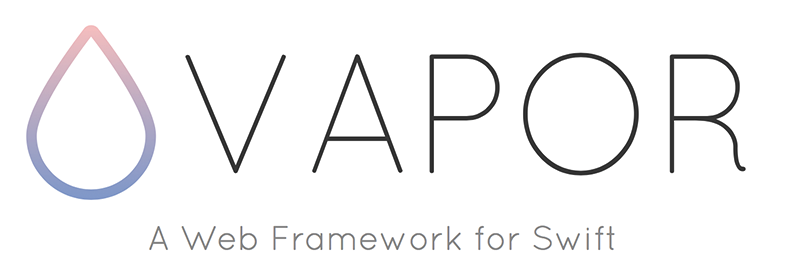

##Swift Server

[不服跑个分 - 顶级 Swift 服务端框架对决 Node.js](http://www.jianshu.com/p/e44bddf43ee0)

***

##Perfect

> Perfect是一组完整、强大的工具箱、软件框架体系和Web应用服务器，可以在Linux、iOS和macOS (OS X)上使用。

[官网](https://www.perfect.org)
| [官方文档](https://github.com/PerfectlySoft/Perfect/blob/master/README.zh_CN.md)
| [Github](https://github.com/PerfectlySoft/Perfect)

* [Perfect 网络框架的应用 —— 基本方法、MySQL连接和Cpp代码接入](http://www.jianshu.com/p/bdc56771d13a)
* [Perfect 网络框架的应用 —— 动态博客开发](http://www.jianshu.com/p/5bcd60439f1b)
* [使用 Server-Side Swift 开发 RESTful API](http://www.liuhaihua.cn/archives/478555.html)
* Swift3.0服务端开发,Perfect 环境搭建/路由配置、表单提交/Mustache模板/MySQL数据库连接/iOS记事本的开发
	* [Swift3.0服务端开发(一) 完整示例概述及Perfect环境搭建与配置](http://www.cnblogs.com/ludashi/p/6145344.html)
	* [Swift3.0服务端开发(二) 静态文件添加、路由配置以及表单提交](http://www.cnblogs.com/ludashi/p/6160898.html)
	* [Swift3.0服务端开发(三) Mustache页面模板与日志记录](http://www.cnblogs.com/ludashi/p/6164931.html)
	* [Swift3.0服务端开发(四) MySQL数据库的连接与操作](http://www.cnblogs.com/ludashi/p/6165418.html)
	* [Swift3.0服务端开发(五) 记事本的开发（iOS端+服务端）](http://www.cnblogs.com/ludashi/p/6179711.html)		
* [从头开始创建一个基于Swift的Perfect的服务端](http://www.jianshu.com/p/a4741a89f679)
* [尝试Swift服务器框架 - Perfect](http://www.jianshu.com/p/316a44bdeeeb)
* [Swift3.0用Perfect和MySQL搭自己的服务器](http://www.jianshu.com/p/6496e53f1690)
* [Swift3.0用Perfect+MYSQL搭建服务器](http://www.jianshu.com/p/c117294e2442)
	
###Linux
* [Perfect让Swift在服务器端跑起来]
	* [Perfect让Swift在服务器端跑起来－引言（一）](http://blog.csdn.net/kinfey/article/details/50644752)
	* [Perfect让Swift在服务器端跑起来－Hi Linux(二)](http://blog.csdn.net/kinfey/article/details/50664353)
	* [Perfect让Swift在服务器端跑起来－在Linux上创建你的Perfect项目(三)](http://blog.csdn.net/kinfey/article/details/50683127)
	* [Perfect让Swift在服务器端跑起来－Perfect in Visual Studio Code (四)](http://blog.csdn.net/kinfey/article/details/50740657)
	* [Perfect让Swift在服务器端跑起来－让Perfect更Rails (五)](http://blog.csdn.net/kinfey/article/details/50754770)

###Ubuntu
* [Swift/Perfect部署到Ubuntu上](http://www.jianshu.com/p/ae96107ec1ae)

###Example
* [SwiftServer](https://github.com/kongfanwu/SwiftServer)

***

##Vapor:
>Vapor 是基于 Swift 实现的 Web 框架与服务，可运行于 OS X 和 Ubuntu 系统上。

[官方网站](https://vapor.codes)
| [官方文档](https://vapor.github.io/documentation/getting-started/install-swift-3-macos.html)
| [Github](https://github.com/vapor/vapor)

###macOS
* [服务端 Swift - Vapor 篇](http://www.jianshu.com/p/3fc28570d951)
* [使用 Swift 3.0 操作 MySQL 数据库](http://www.jianshu.com/p/f20586ee8ec0)
* [Swift 后台开发 -- 登录授权（User & Model](http://www.jianshu.com/p/25df9b538007)
* [Vapor系列教程 - 目录](http://www.jianshu.com/p/083a5486feda)
* [Vapor - 用Swift编写你的App后台](http://www.jianshu.com/p/78ccf0547549)
* [Swift服务端-Vapor初次使用](http://www.jianshu.com/p/5b435c295491)
* [用 Swift 写服务器端](http://www.jianshu.com/p/c3ff6932e51a)
* [Vapor 快速上手教程](http://www.jianshu.com/p/2baa8e0adf55)
* [用 Swift 開發 Server Side App](http://iosdevelopersnote.blogspot.com/2016/02/swift-server-side-app-swift-package.html)
* [Swift 開發者！用Vapor打造你的第一個Web App吧](http://www.appcoda.com.tw/server-side-swift-vapor)
* [LookupWord - 用Vapor架設Swift伺服器 - 和我一起Swift](http://www.jianshu.com/p/5e3d61633908)

###Ubuntu
* [在Ubuntu安装swift3.0并部署Vapor](http://www.jianshu.com/p/dab36098d17e)

***

## Contacts	

#####欢迎完善、共同学习。
* email : hi@jinxiansen.com
* Sina : [@晋先森](http://weibo.com/3205872327)
* Twitter : [@jinxiansen](https://twitter.com/jinxiansen)

## License	

SwiftServerDocument is released under the [MIT license](LICENSE). See LICENSE for details.
